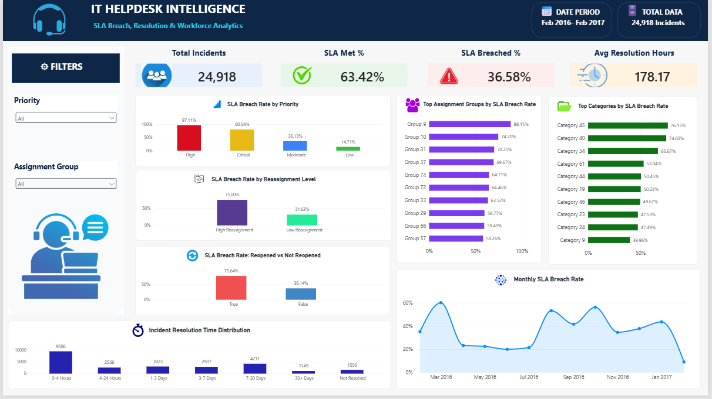

# IT Helpdesk Intelligence

### SLA Breach, Resolution & Workforce Analytics

## Project Overview

IT Helpdesk Intelligence is a data analytics project that analyzes IT service desk incidents to identify SLA breaches, resolution-time patterns, high-risk priorities, reassignment issues, and workforce-related performance patterns.

The project transforms an event-level IT helpdesk dataset into an incident-level analytical dataset and uses Python, PostgreSQL, SQL, and Power BI to perform data cleaning, analysis, visualization, and business insight generation.

## Business Problem

IT support teams need to resolve incidents within defined Service Level Agreement (SLA) targets while managing different priorities, assignment groups, and resolution workloads.

The objective of this project is to analyze historical IT helpdesk incidents and identify the major factors associated with SLA breaches, prolonged resolution times, and repeated incident handling.

## Project Objectives

- Measure overall SLA performance and breach rate.
- Analyze SLA breaches across incident priorities.
- Identify assignment groups with high SLA breach rates.
- Examine the relationship between reassignment and SLA breaches.
- Analyze reopened incidents and their SLA performance.
- Understand incident resolution-time distribution.
- Identify high-breach incident categories.
- Analyze monthly SLA breach trends.
- Provide actionable recommendations to improve helpdesk performance.
## Dataset

The project uses the UCI Machine Learning Repository dataset:

**Incident management process enriched event log**

The dataset contains historical IT service desk event records collected from a ServiceNow-based incident management system.

### Dataset Details

- Event records: 141,712
- Unique incidents: 24,918
- Attributes: 36
- Data period: February 2016 – February 2017
- Format: CSV
- Source: UCI Machine Learning Repository

### Data Preparation

The original dataset is an event-level log, where a single incident can contain multiple event records. Therefore, the data was transformed into an incident-level analytical dataset.

The preparation process included:

- Inspecting the raw dataset and data types.
- Handling `?` values as unknown/missing values.
- Converting date and time fields into appropriate datetime formats.
- Consolidating multiple event records into one record per incident.
- Calculating resolution and closure durations.
- Creating SLA status classifications.
- Creating resolution-time buckets.
- Creating reassignment-level classifications.
- Validating duplicate incident IDs and negative time values.
- Creating the final analytical dataset for SQL and Power BI analysis.
## Tools & Technologies

| Tool | Purpose |
|---|---|
| Python | Data inspection, cleaning, transformation, and exploratory analysis |
| Pandas | Data manipulation and incident-level dataset creation |
| PostgreSQL | Storing and querying the analytical dataset |
| SQL | Business analysis and KPI calculations |
| Power BI | Interactive dashboard and data visualization |
| DAX | Measures and calculated columns in Power BI |
| GitHub | Project version control and portfolio presentation |
## Project Workflow

The project follows a structured data analytics workflow:

1. **Data Collection**
   - Obtained the Incident Management Process Enriched Event Log dataset from the UCI Machine Learning Repository.

2. **Data Inspection**
   - Examined dataset structure, data types, missing values, duplicate records, and incident-level event patterns using Python.

3. **Data Cleaning & Transformation**
   - Cleaned and transformed the event-level data using Pandas.
   - Consolidated event records into an incident-level dataset.
   - Created resolution-time, SLA, and reassignment-related analytical fields.

4. **Data Validation**
   - Checked for duplicate incident IDs, invalid date calculations, negative durations, and missing values.

5. **Database & SQL Analysis**
   - Loaded the analytical dataset into PostgreSQL.
   - Used SQL to calculate KPIs and investigate SLA performance, priorities, assignment groups, and resolution patterns.

6. **Exploratory Data Analysis**
   - Used Python to identify important patterns and relationships within the incident data.

7. **Power BI Dashboard**
   - Built an interactive dashboard showing KPIs, SLA performance, priority analysis, reassignment impact, reopened incidents, resolution-time distribution, high-breach groups/categories, and monthly SLA trends.

8. **Business Insights**
   - Converted analytical findings into actionable recommendations for improving IT helpdesk performance.
   ## Key Business Insights

The analysis of 24,918 IT helpdesk incidents revealed the following key findings:

### 1. Overall SLA Performance

- 63.42% of incidents met the SLA.
- 36.58% of incidents breached the SLA.
- SLA-breached incidents had a much higher average resolution time than SLA-met incidents.

**Insight:** A significant portion of incidents exceed their expected resolution targets, indicating the need for earlier monitoring and escalation of at-risk tickets.

### 2. Priority and SLA Breaches

- High-priority incidents had a 97.11% SLA breach rate.
- Critical incidents had an 80.54% SLA breach rate.
- Moderate incidents had a 36.13% breach rate.
- Low-priority incidents had a 14.71% breach rate.

**Insight:** Higher-priority incidents show substantially higher breach rates and should receive stronger escalation and monitoring.

### 3. Reassignment and SLA Performance

- Incidents with high reassignment (3 or more reassignments) had a 75.00% SLA breach rate.
- Incidents with fewer than 3 reassignments had a 31.62% breach rate.

**Insight:** Frequent reassignment is strongly associated with SLA breaches and may indicate routing or handoff inefficiencies.

### 4. Reopened Incidents

- Reopened incidents had a 75.64% SLA breach rate.
- Incidents that were not reopened had a 36.14% breach rate.

**Insight:** Reopened incidents are associated with substantially higher SLA breach rates and should be monitored for recurring issues and resolution-quality problems.

### 5. High-Breach Assignment Groups

Several assignment groups showed substantially higher SLA breach rates than the overall average.

The highest observed breach rate among groups with at least 100 incidents was:

- Group 9 — 88.15%
- Group 10 — 74.70%
- Group 31 — 70.25%
- Group 37 — 69.67%

**Insight:** High-breach assignment groups should be reviewed for workload, routing, staffing, and process-related issues.

### 6. Resolution-Time Distribution

- 38.15% of incidents were resolved within 4 hours.
- 16.90% took 7–30 days.
- 4.61% took more than 30 days.
- 6.24% were not resolved.

**Insight:** Although many incidents are resolved quickly, a significant long-resolution tail exists and requires attention.

### Business Recommendations

Based on the analysis:

- Prioritize proactive monitoring of High and Critical incidents.
- Review tickets with frequent reassignment to identify routing and handoff issues.
- Investigate reopened incidents to identify recurring resolution problems.
- Conduct operational reviews of consistently high-breach assignment groups.
- Monitor long-running and unresolved incidents through escalation mechanisms.
- Track SLA breach rates together with incident volume to identify meaningful operational trends.
## Power BI Dashboard

An interactive Power BI dashboard was developed to provide a consolidated view of IT helpdesk performance.

### Dashboard Components

The dashboard includes:

- Total Incidents
- SLA Met %
- SLA Breached %
- Average Resolution Hours
- SLA Breach Rate by Priority
- SLA Breach Rate by Reassignment Level
- SLA Breach Rate for Reopened vs Not Reopened Incidents
- Incident Resolution-Time Distribution
- Top Assignment Groups by SLA Breach Rate
- Top Incident Categories by SLA Breach Rate
- Monthly SLA Breach Rate
- Interactive filters for Priority and Assignment Group

### Dashboard Purpose

The dashboard helps users quickly identify:

- Overall SLA performance.
- High-risk incident priorities.
- Assignment groups with elevated breach rates.
- The relationship between reassignment and SLA performance.
- Patterns among reopened incidents.
- Long-running and unresolved incidents.
- Changes in SLA breach rates over time.
## SQL Analysis

PostgreSQL was used to store the cleaned incident-level analytical dataset and perform business-focused SQL analysis.

The analysis covered:

- Total incident volume.
- SLA met and breached incidents.
- SLA breach rate by priority.
- Average resolution time by SLA status.
- SLA performance by assignment group.
- SLA performance based on reassignment levels.
- SLA performance for reopened incidents.
- Incident resolution-time distribution.
- High-breach incident categories.
- Monthly SLA breach trends.

SQL queries were designed to answer practical IT helpdesk business questions and support the findings presented in the Power BI dashboard.
## Python Analysis

Python and Pandas were used for data inspection, cleaning, transformation, validation, and exploratory analysis.

The Python analysis included:

- Inspecting the original event-level dataset.
- Identifying unique incidents and event patterns.
- Handling unknown values represented by `?`.
- Converting date and time fields into appropriate formats.
- Creating an incident-level dataset from the event log.
- Calculating resolution and closure durations.
- Creating SLA status and resolution-time classifications.
- Validating the processed dataset.
- Analyzing SLA performance by priority, reassignment level, reopened status, assignment group, and category.
- Examining resolution-time distributions and monthly SLA trends.

The processed analytical dataset was then used for PostgreSQL and Power BI analysis.
## Project Structure

```text
IT-Helpdesk-Analytics/
│
├── data/
│   ├── raw/
│   │   └── incident_event_log.csv
│   │
│   └── processed/
│       ├── incidents_cleaned.csv
│       └── incidents_analytics.csv
│
├── python/
│   ├── 01_inspect_data.py
│   ├── 02_explore_incident.py
│   ├── 03_create_incident_dataset.py
│   ├── 04_validate_cleaned_data.py
│   ├── 05_create_analytics_table.py
│   └── 06_initial_analysis.py
│
├── sql/
│   └── 01_helpdesk_analysis.sql
│
├── powerbi/
│   └── IT_Helpdesk_Intelligence.pbix
│
├── screenshots/
│
└── README.md
```
## Dataset Source & Credits

This project uses the **Incident Management Process Enriched Event Log** dataset from the UCI Machine Learning Repository.

**Dataset:** Incident management process enriched event log  
**Source:** UCI Machine Learning Repository  
**Dataset ID:** 498  
**License:** CC BY 4.0

The original dataset was used for educational and portfolio analysis. The raw dataset has been kept unchanged, while all cleaning and transformation steps were performed separately to create the analytical dataset.

Dataset source: https://archive.ics.uci.edu/dataset/498/incident%2Bmanagement%2Bprocess%2Benriched%2Bevent%2Blog

## Conclusion

IT Helpdesk Intelligence demonstrates an end-to-end data analytics workflow using real-world IT service desk data.

The project combines Python-based data preparation, PostgreSQL and SQL analysis, and Power BI visualization to identify SLA performance patterns, high-risk incident areas, reassignment and reopening patterns, and resolution-time issues.

The analysis provides practical insights that can help IT support teams focus on high-priority incidents, reduce inefficient handoffs, investigate recurring issues, and improve SLA monitoring.

This project also demonstrates practical skills in data cleaning, data transformation, SQL, exploratory data analysis, DAX, dashboard development, and business-oriented insight generation.

## Project Highlights

- Built an end-to-end IT helpdesk analytics solution from raw event-level data to an interactive Power BI dashboard.
- Transformed 141,712 event records into 24,918 incident-level records.
- Used Python and Pandas for data cleaning, transformation, and validation.
- Used PostgreSQL and SQL for business-focused analysis.
- Created DAX measures and calculated columns for Power BI analytics.
- Identified SLA breach patterns across priority, reassignment, reopened incidents, assignment groups, and categories.
- Designed an interactive dashboard with KPI cards, analytical charts, and filters.
- Generated actionable business recommendations from the analysis.

## Power BI Dashboard Preview

